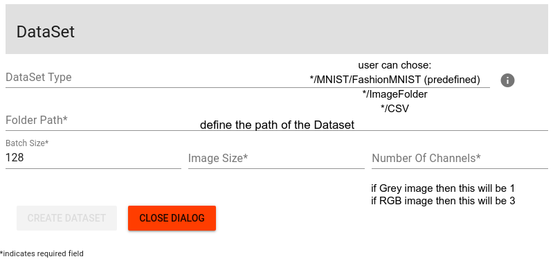

# Dataset Configuration
the Dataste/Dataloader is very important in the GAN framework as it will be used by the Discriminator to learn real Data and then differentiate it from artificial Data.

This component supports different options for configuration:
 * use predefined Datasets: MNIST & FashionMNIST (the dataset can be downloaded)
 * use ImageFolder (dataset must be in local machine)
 * use CSV file

It is very important to provide the path to the Dataset.
Please have a look at [pytorch doc](https://pytorch.org/docs/stable/torchvision/datasets.html#imagefolder)

The interface for this component looks like:

Format: 